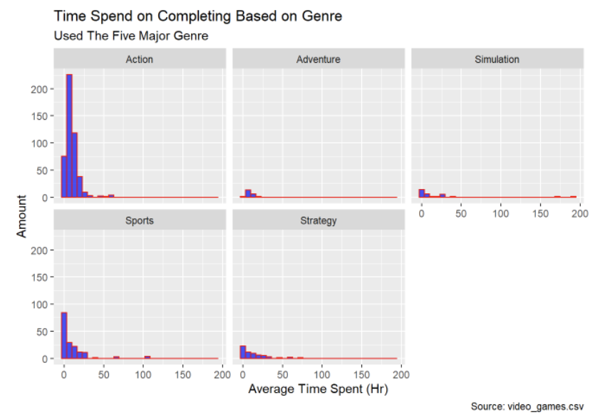

### Time Spent to Complete the Game Based on Genre  

For this page, we will take a look at the 5 types of video game genres, and take a closer look at how genre can effect time spent playing it. Below is the faceted histogram that shows the 5 plots. Each plot represents one genre, with the X axis being hours spend and Y axis being number of games in the given time and genre.

  

### Taking a Look Individually:  

Since the five plot uses the same scales, for number of games with greater difference, it is harder to understand. Below is a tab where you can select the type of genre to take a closer look at each of genres shown above. You can also hover over each bar to see the actual amount.