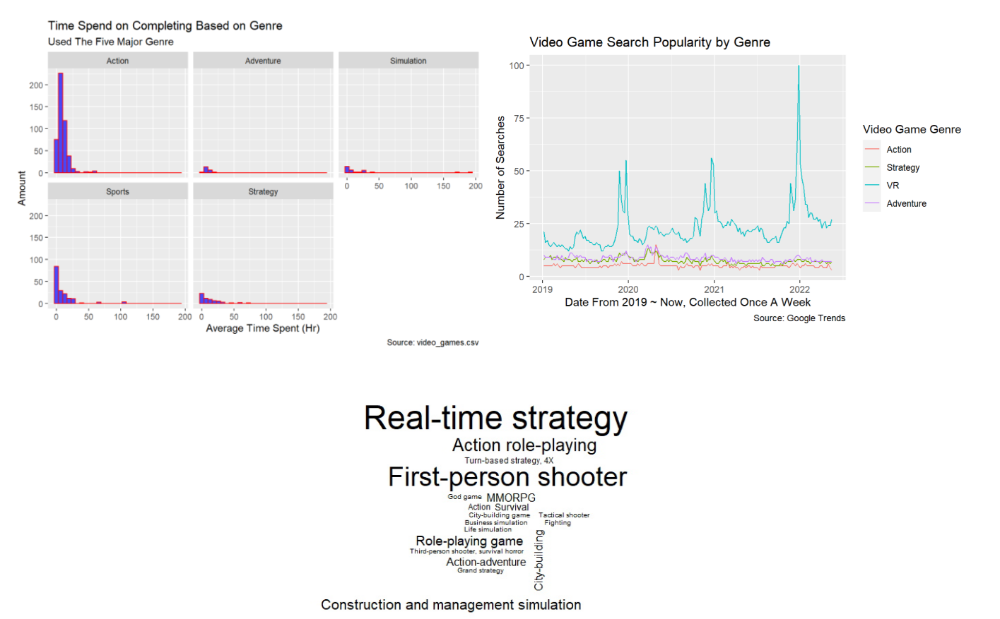

This is the summary page of our final project with some interesting discoveries that we have made.

### Conclusion

Based on chart 1 (Top Left), we can conclude that action games is the most popular one, however, people spend the most time to finish strategy games.

For chart 2 (Top Right), from pre-COVID to present, we can conclude that VR games is the most popular based on searching, though it is important to keep in mind that VR games can have many genres as well, with some games like [Minecraft](https://www.minecraft.net/en-us/vr) and [Among Us](https://www.innersloth.com/games/among-us-vr/) having a VR version.

Based on chart 3 (Bottom), we can conclude that Real Time Strategy (RTS) is the most popular video game genre.

Lastly, we observed that COVID did not impact much about how people play video games. However, for video game search, there is an increase in all gaming genres during the spring of 2020.

Overall, it was difficult to determine change in trends due to COVID due to the secretive nature and privacy of the the video game industry. In the future we hope to collect more exhaustive data, especially between 2019 and 2022.
